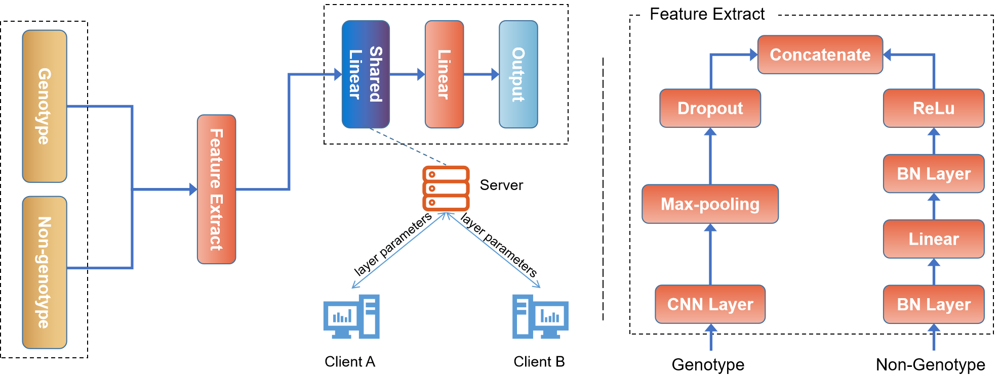

FedGS: Genomic Selection with Federated Learning
---

​The program 'fedgs' can be used to perform genomic selection with our proposed federated learning algorithm. In this program, phenotypes of your own data can be predicted using our algorithms. The effectiveness of FedGS has been demonstrated on a wide range of datasets, both simulated and real-world.

# Installation
## Docker Installtion
Go to [docker website](https://www.docker.com/) and download the version satisfying your machine.
## FedGS Docker image installation and quickly start
```bash
docker pull linjie7674/fedgs
docker run -it linjie7674/fedgs python3 dockerMain.py kfold --isFed False --genotype test 
```
**Note:** Test data is only used to test the program correction, and doesn't have any meaning. If the above commands are excuted correctly, your installation is successful.

# Prepare Data
This project used many datasets.It contains public data and private data.
- test data

    test data is only used to test the program correction. 
- your own data
    
    You can use your own data, which must be orginized by the follow structure.
    
    ```
    - data
        - dataset_name your dataset name, which you can define it by yourself
            - datas.h5 this file includes your genotype data, where the first column should represent id 
            number, and the others should be genotype data
            - labels_*.h5 this file includes your label data, where the first column should be the id number,
            and the others should be the labels corrsponding to id number. The `*` repersents that you can
            place different labels in your directory and you can define every labels data's name.
    ```

# Run
## Train using 10-fold cross validation
```bash
docker run -it -v {host directory of your own data}:/fedgs/data linjie7674/fedgs python3 dockerMain.py kfold --isFed True --genotype {local dataset name} --label_suf {local label suffix} --fed_genotyp {others dataset name} --fed_label_suf {others label suffix}
```
**Note:** Supposing that user's private dataset is located in directory __`/home/test`__ , the change the words above __`({host directory of your own data})`__ to use's directory __`/home/test`__.

- isFed: train solely or federated learning
- genotype: directory name of local dataset directory
- label_suf: label suffix of local dataset
- fed_genotype: external dataset directory name, which will be - federated learning with your local data.
- fed_label_suf: label suffix of external dataset
## Train Purely
Train without 10-fold cross validation.
```bash
docker run -it -v {host directory of your own data}:/fedgs/data linjie7674/fedgs python3 dockerMain.py train --isFed True --dataset_name {data1} --fed_dataset_name {data2} --batch_size 28 --lr 0.001 --study_name fedgs
```
The data used for pure training should be organized in this way.
```
- data
    - dataset_name
        - {dataset_name}_train_datas.h5
        - {dataset_name}_valid_datas.h5
        - {dataset_name}_test_datas.h5
```

## Test
Test is to get model accuracy.
```bash
docker run -it -v {host directory of your own data}:/fedgs/data linjie7674/fedgs python3 dockerMain.py test --dataset_name {directory of data} --model_path {path of trained model}
```
## Inference
Inference is to obtain trait by genotype.
```bash
docker run -it -v {host directory of your own data}:/fedgs/data linjie7674/fedgs python3 dockerMain.py infer --dataset_name {directory of data} --model_path {path of trained model}
```

# Run on GPU
```bash
docker run -it --gpus all linjie7674/fedgs python3 dockerMain.py ...
```

# Get more information about the command
```bash
docker run -it linjie7674/fedgs python3 dockerMain.py --help
```